# Pawfront Database

SQL Server schema for Pawfront's structured (relational) data. Per-category
service offering details and event extension data live in **Cosmos DB**, not
here — see the API project's `docs/architecture.md` for the split.

Tables are organised into four schemas:

| Schema      | Purpose |
|-------------|---------|
| `Provider`  | Provider identity, profile, OTPs, devices, services, availability, closures, policies |
| `Customer`  | Pet-parent scaffolding (`PetParents`, `Pets`) — used by bookings only; no APIs yet |
| `Event`     | Provider-created events + amenities junction + ticket bookings |
| `Booking`   | Real bookings (per-service capacity-checked) |

Deployment is a single idempotent script:
[`Deployment/DeployAll.sql`](Deployment/DeployAll.sql). Re-runnable; uses
`IF NOT EXISTS` guards on tables/indexes and `CREATE OR ALTER` on sprocs.

## ER diagram

```mermaid
erDiagram
    PROVIDER_AUTH_IDENTITIES ||--o| PROVIDERS                    : "step 1 -> step 2"
    PROVIDER_AUTH_IDENTITIES ||--o{ PROVIDER_DEVICE_TOKENS       : "registers"
    PROVIDERS                |o--o{ PROVIDER_DEVICE_TOKENS       : "owns (after step 2)"
    PROVIDERS                ||--o{ PROVIDER_MOBILE_OTPS         : "verifies via"
    PROVIDERS                ||--o| PROVIDER_SERVICE_REGISTRATIONS : "registers (1 category max)"
    PROVIDERS                ||--o{ PROVIDER_SERVICES            : "offers (1 row per ServiceType)"
    PROVIDERS                ||--o{ PROVIDER_WEEKLY_AVAILABILITY : "schedules (0..7 rows)"
    PROVIDERS                ||--o{ PROVIDER_CLOSURES            : "closes"
    PROVIDER_SERVICES        ||--o{ PROVIDER_CLOSURES            : "scoped by"
    PROVIDERS                ||--o{ PROVIDER_PAYOUT_METHODS      : "configures"
    PROVIDERS                ||--o| PROVIDER_CANCELLATION_POLICIES : "configures"
    PROVIDERS                ||--o{ EVENTS                       : "creates"
    EVENTS                   ||--o{ EVENT_AMENITIES              : "lists"
    EVENTS                   ||--o{ EVENT_BOOKINGS               : "sells tickets for"
    EVENT_BOOKINGS           ||--o{ EVENT_BOOKING_TICKETS        : "issues (1..N attendees)"
    EVENTS                   ||--o{ EVENT_BOOKING_TICKETS        : "denormalised"
    PROVIDERS                ||--o{ BOOKINGS                     : "fulfills"
    PET_PARENTS              ||--o{ BOOKINGS                     : "places"
    PROVIDER_SERVICES        ||--o{ BOOKINGS                     : "targets"
    PET_PARENTS              ||--o{ PETS                         : "has"

    PROVIDER_AUTH_IDENTITIES {
        UNIQUEIDENTIFIER ProviderAuthIdentityId PK
        UNIQUEIDENTIFIER ProviderId            FK "nullable until step 2 completes"
        NVARCHAR         FirebaseUserId        UK
        NVARCHAR         AuthProvider             "Google|Apple|EmailPassword"
        NVARCHAR         Email
        BIT              IsEmailVerified
        NVARCHAR         SignUpStatus             "FirebaseAuthenticated|ProviderProfileCompleted"
        DATETIME2        LastSignedInAtUtc
    }

    PROVIDERS {
        UNIQUEIDENTIFIER ProviderId             PK
        UNIQUEIDENTIFIER ProviderAuthIdentityId FK "UNIQUE; links to auth identity"
        NVARCHAR         FirstName
        NVARCHAR         LastName
        NVARCHAR         Gender                    "Male|Female|NonBinary|Other|PreferNotToSay"
        NVARCHAR         MobileCountryCode         "UNIQUE with MobileNumber"
        NVARCHAR         MobileNumber
        DATE             DateOfBirth
        DATETIME2        MobileVerifiedAtUtc       "nullable"
        NVARCHAR         OnboardingStatus          "MobileVerificationPending|MobileVerified"
    }

    PROVIDER_DEVICE_TOKENS {
        UNIQUEIDENTIFIER ProviderDeviceTokenId  PK
        UNIQUEIDENTIFIER ProviderAuthIdentityId FK
        UNIQUEIDENTIFIER ProviderId             FK "nullable; back-filled after step 2"
        NVARCHAR         FcmToken               UK
        NVARCHAR         DeviceId
        NVARCHAR         DevicePlatform           "Android|iOS"
        BIT              IsActive
        DATETIME2        LastSeenAtUtc
    }

    PROVIDER_MOBILE_OTPS {
        UNIQUEIDENTIFIER ProviderMobileOtpId PK
        UNIQUEIDENTIFIER ProviderId          FK
        NVARCHAR         MobileCountryCode
        NVARCHAR         MobileNumber
        VARBINARY        OtpCodeHash            "SHA-256"
        NVARCHAR         OtpCodeLastTwo
        NVARCHAR         ValidationStatus       "Pending|Validated|Expired"
        INT              FailedAttemptCount
        DATETIME2        DateSentUtc
        DATETIME2        DateValidatedUtc       "nullable"
        DATETIME2        ExpiresAtUtc
    }

    PROVIDER_SERVICE_REGISTRATIONS {
        UNIQUEIDENTIFIER ProviderServiceRegistrationId PK
        UNIQUEIDENTIFIER ProviderId                    FK "UNIQUE; one row per provider"
        NVARCHAR         ServiceCategory                     "PetSitter|PetGroomer|PetTrainer|PetAdoptionAndSale|Vet"
        NVARCHAR         SubCategory
        DECIMAL          Latitude                            "-90..90"
        DECIMAL          Longitude                           "-180..180"
    }

    PROVIDER_SERVICES {
        UNIQUEIDENTIFIER ServiceId       PK
        UNIQUEIDENTIFIER ProviderId      FK   "ON DELETE CASCADE"
        NVARCHAR         ServiceCategory      "PetSitter|PetGroomer|PetTrainer|Vet"
        NVARCHAR         SubCategory
        NVARCHAR         ServiceType          "DayCare|NightStay|GroomingSession|TrainingSession|VetAppointment"
        BIT              IsActive             "soft-deactivate; never deleted"
    }

    PROVIDER_WEEKLY_AVAILABILITY {
        UNIQUEIDENTIFIER ProviderId      PK "also FK; ON DELETE CASCADE"
        TINYINT          DayOfWeek       PK "0=Sunday..6=Saturday"
        BIT              IsOpen
        TIME             StartTime          "nullable when closed"
        TIME             EndTime            "nullable when closed"
        TIME             BreakStartTime     "nullable; must fit window"
        TIME             BreakEndTime       "nullable"
    }

    PROVIDER_CLOSURES {
        UNIQUEIDENTIFIER ClosureId   PK
        UNIQUEIDENTIFIER ProviderId  FK    "ON DELETE CASCADE; denormalised for fast filter"
        UNIQUEIDENTIFIER ServiceId   FK    "closures are PER-SERVICE"
        DATE             StartDate
        DATE             EndDate
        TIME             StartTime         "nullable; full-day if NULL"
        TIME             EndTime           "nullable"
        NVARCHAR         Reason            "nullable; <=500 chars"
    }

    PROVIDER_PAYOUT_METHODS {
        UNIQUEIDENTIFIER ProviderId    PK "also FK"
        NVARCHAR         PayoutMethod  PK "Cash|Digital"
    }

    PROVIDER_CANCELLATION_POLICIES {
        UNIQUEIDENTIFIER ProviderId                    PK "also FK"
        INT              MinimumHoursBeforeCancellation    "null|24|48|72|96"
    }

    PET_PARENTS {
        UNIQUEIDENTIFIER PetParentId PK
    }

    PETS {
        UNIQUEIDENTIFIER PetId       PK
        UNIQUEIDENTIFIER PetParentId FK
    }

    EVENTS {
        UNIQUEIDENTIFIER EventId         PK
        UNIQUEIDENTIFIER ProviderId      FK
        NVARCHAR         EventCategory       "8 values; see CHECK"
        BIT              IsChildFriendly
        NVARCHAR         Title
        NVARCHAR         Description
        NVARCHAR         BannerImageUrl      "nullable"
        NVARCHAR         EventType           "Physical|Online"
        DATE             StartDate
        DATE             EndDate
        TIME             StartTime
        TIME             EndTime
        INT              ViewCount           "default 0"
        INT              ShareCount          "default 0"
        INT              InquiryCount        "default 0"
    }

    EVENT_AMENITIES {
        UNIQUEIDENTIFIER EventId PK "also FK; ON DELETE CASCADE"
        NVARCHAR         Amenity PK "8 values; None cannot coexist"
    }

    EVENT_BOOKINGS {
        UNIQUEIDENTIFIER BookingId        PK
        UNIQUEIDENTIFIER EventId          FK
        NVARCHAR         BookerName            "no FK; free text"
        NVARCHAR         BookerEmail
        NVARCHAR         BookerMobile          "nullable"
        INT              TicketCount           ">= 1"
        NVARCHAR         PaymentMethod         "CreditCard|Twint"
        NVARCHAR         PaymentStatus         "Pending|Paid|Failed"
        NVARCHAR         PaymentReference      "nullable; gateway ref"
        DECIMAL          TotalAmount           ">= 0; price*count snapshot"
        NVARCHAR         Status                "Confirmed|Cancelled"
        DATETIME2        CancelledAtUtc        "nullable"
    }

    EVENT_BOOKING_TICKETS {
        UNIQUEIDENTIFIER TicketId      PK
        UNIQUEIDENTIFIER BookingId     FK "ON DELETE CASCADE"
        UNIQUEIDENTIFIER EventId       FK "denormalised"
        INT              TicketNumber     "1..N; UNIQUE with BookingId"
        NVARCHAR         AttendeeName     "no FK; free text"
    }

    BOOKINGS {
        UNIQUEIDENTIFIER BookingId       PK
        UNIQUEIDENTIFIER ProviderId      FK
        UNIQUEIDENTIFIER PetParentId     FK
        UNIQUEIDENTIFIER ServiceId       FK   "scopes capacity + closures"
        NVARCHAR         ServiceCategory      "denormalised snapshot"
        NVARCHAR         SubCategory          "denormalised snapshot"
        DATE             BookingDate
        TIME             StartTime
        TIME             EndTime
        NVARCHAR         Status               "Confirmed|Cancelled|Completed|NoShow"
        DATETIME2        CancelledAtUtc       "nullable; required when Status=Cancelled"
    }
```



> The diagram renders inline on GitHub, Azure DevOps, GitLab, and any
> Mermaid-aware markdown viewer (VS Code with the Markdown All in One
> extension, IntelliJ, Obsidian, etc.). It is intentionally text-based so
> the schema stays version-controlled with the SQL.

## Provider schema

### `Provider.ProviderAuthIdentities`
Firebase-authenticated sign-up row, created BEFORE the provider has filled
in personal details. The Pawfront API verifies the Firebase ID token and
upserts on `FirebaseUserId`.

- `ProviderAuthIdentityId` — PK for step 1.
- `ProviderId` — nullable until step 2 (`Provider.CompleteProviderProfile`) runs.
- `FirebaseUserId` — Firebase UID, globally unique.
- `AuthProvider` — `Google`, `Apple`, or `EmailPassword`.
- `FirebaseProviderId`, `FirebaseTenantId` — optional raw Firebase metadata.
- `Email`, `IsEmailVerified`, `DisplayName`, `FirebasePhoneNumber`, `PhotoUrl`.
- `SignUpStatus` — `FirebaseAuthenticated` or `ProviderProfileCompleted`.
- `LastSignedInAtUtc`, `CreatedAtUtc`, `UpdatedAtUtc`.

### `Provider.Providers`
The main provider entity. `ProviderId` is the primary correlation key used
throughout the application.

- `ProviderId` — PK.
- `ProviderAuthIdentityId` — UNIQUE FK back to step 1.
- `FirstName`, `LastName`, `Gender` (CHECK list).
- `MobileCountryCode`, `MobileNumber` — UNIQUE together.
- `DateOfBirth`.
- `MobileVerifiedAtUtc` — populated after OTP validation.
- `OnboardingStatus` — `MobileVerificationPending` → `MobileVerified`.

### `Provider.ProviderDeviceTokens`
FCM device tokens captured at sign-in. Linked to the auth identity first;
back-filled with `ProviderId` once the profile is completed.

- `ProviderDeviceTokenId` — PK.
- `ProviderAuthIdentityId` — required FK.
- `ProviderId` — nullable FK.
- `FcmToken` — UNIQUE.
- `DeviceId`, `DevicePlatform` (`Android`|`iOS`), `IsActive`, `LastSeenAtUtc`.

### `Provider.ProviderMobileOtps`
Mobile OTP send + validation log. OTP codes are stored as SHA-256 hashes.

- `ProviderMobileOtpId` — PK returned to the client.
- `ProviderId` — FK.
- `MobileCountryCode`, `MobileNumber` — snapshot at send time.
- `OtpCodeHash` — `VARBINARY(32)`.
- `OtpCodeLastTwo` — display hint.
- `ValidationStatus` — `Pending`, `Validated`, or `Expired`.
- `FailedAttemptCount`.
- `DateSentUtc`, `DateValidatedUtc`, `ExpiresAtUtc`.

### `Provider.ProviderServiceRegistrations`
Geo-indexed registration row pinning the provider to **one** service
category. A `UNIQUE (ProviderId)` constraint enforces the
"one-service-per-provider" rule — attempting to register a second category
throws `THROW 51011` (mapped to `409 ServiceCategoryConflict`).

- `ProviderServiceRegistrationId` — PK.
- `ProviderId` — UNIQUE FK.
- `ServiceCategory` — `PetSitter`, `PetGroomer`, `PetTrainer`,
  `PetAdoptionAndSale`, or `Vet`.
- `SubCategory` — category-specific (e.g. `PetHotel`, `FreelancePetSitter`).
- `Latitude`, `Longitude` — geo filter index for discovery.

### `Provider.ProviderServices`
The per-service catalog — **one row per (provider, ServiceType)**.
Upserted automatically when a provider saves an offering: PetSitter with
both DayCare and NightStay produces two rows. Closures, bookings, and slot
queries all reference a specific `ServiceId` from this table. Rows are
**soft-deactivated** (`IsActive = 0`) rather than deleted, so historical
closures/bookings retain referential integrity.

- `ServiceId` — PK; minted on first upsert.
- `ProviderId` — FK with `ON DELETE CASCADE`.
- `ServiceCategory` — `PetSitter`, `PetGroomer`, `PetTrainer`, or `Vet`
  (PetAdoptionAndSale has no offering and no rows here).
- `SubCategory` — denormalised for read convenience.
- `ServiceType` — one of `DayCare`, `NightStay`, `GroomingSession`,
  `TrainingSession`, `VetAppointment`. Compatible with `ServiceCategory`
  via a check constraint.
- `IsActive`.
- UNIQUE `(ProviderId, ServiceType)`.

### `Provider.ProviderWeeklyAvailability`
Seven-day recurring schedule. Composite PK `(ProviderId, DayOfWeek)`.
Cascading delete from `Providers`.

- `DayOfWeek` — `TINYINT 0..6` (`0 = Sunday`).
- `IsOpen` — when `false`, all time columns must be NULL (CHECK).
- `StartTime`, `EndTime` — required when `IsOpen = true`.
- `BreakStartTime`, `BreakEndTime` — optional single break, must lie inside
  `[StartTime, EndTime]`.

### `Provider.ProviderClosures`
Per-service vacation / sick-leave windows. A closure on DayCare does **not**
block NightStay slots/bookings.

- `ClosureId` — PK.
- `ProviderId` — FK with `ON DELETE CASCADE` (denormalised for fast
  filter; the source of truth is `ServiceId`).
- `ServiceId` — FK → `ProviderServices`.
- `StartDate`, `EndDate` — `EndDate >= StartDate`.
- `StartTime`, `EndTime` — both NULL = full-day closure across the range;
  both set requires `StartDate = EndDate` (partial-day on one day).
- `Reason` — optional, ≤500 chars.

### `Provider.ProviderPayoutMethods`
Junction. A provider can enable `Cash`, `Digital`, both, or neither.

- PK `(ProviderId, PayoutMethod)`.
- `PayoutMethod` — `Cash` or `Digital` (CHECK).

### `Provider.ProviderCancellationPolicies`
One row per provider. Nullable cancellation window.

- `ProviderId` — PK + FK.
- `MinimumHoursBeforeCancellation` — `NULL`, `24`, `48`, `72`, or `96` (CHECK).

## Customer schema

### `Customer.PetParents`
Pet-parent identity. **Scaffolding only** — there is no API to create pet
parents yet. Bookings expect rows to exist (referenced by FK), so tests/dev
must seed `PetParents` directly.

- `PetParentId` — PK.

### `Customer.Pets`
Pets owned by a parent. Scaffolding only; no APIs.

- `PetId` — PK.
- `PetParentId` — FK.

## Event schema

### `Event.Events`
Provider-created events (adoption drives, training sessions, charity,
etc.). Physical-event extension data (capacity + ticketing) lives in
**Cosmos** (`Events` container), keyed by the same `EventId`. Online events
have no Cosmos doc.

- `EventId` — PK.
- `ProviderId` — FK.
- `EventCategory` — one of 8 values: `AdoptionAndRescue`, `PetTraining`,
  `Charity`, `Volunteering`, `HealthAndWellness`, `SocialAndCultural`,
  `OutdoorActivities`, `ParentEducation`.
- `IsChildFriendly`.
- `Title`, `Description` (NVARCHAR(MAX)), `BannerImageUrl` (nullable).
- `EventType` — `Physical` or `Online`.
- `StartDate <= EndDate` (CHECK), `StartTime`, `EndTime`.
- `ViewCount`, `ShareCount`, `InquiryCount` — organiser-dashboard
  engagement counters. Default 0; atomically incremented by
  `Event.IncrementEventCounter` from the three public increment
  endpoints. Read in `Event.GetEventMetrics`.

### `Event.EventAmenities`
Junction listing the venue amenities for an event.

- PK `(EventId, Amenity)` with `ON DELETE CASCADE`.
- `Amenity` — one of `FreeParking`, `PaidParking`, `Restrooms`,
  `DrinkingWater`, `FoodAndBeverage`, `SeatingAreas`, `FirstAidBooth`,
  `None`. The C# layer rejects `None` together with any other amenity.

### `Event.EventBookings`
Ticket purchases against a physical event. **Booker identity is free text**
— anyone with a Firebase login can buy tickets for any names. There is no
FK to `Customer.PetParents`. Capacity is enforced inside
`Event.CreateEventBooking` by SUMming `TicketCount` over confirmed rows for
the event under `UPDLOCK + HOLDLOCK`.

- `BookingId` — PK.
- `EventId` — FK → `Event.Events`.
- `BookerName`, `BookerEmail`, `BookerMobile` — free text; the contact for
  the buyer of the tickets.
- `TicketCount` — denormalised count of child ticket rows; feeds the
  race-safe capacity check.
- `PaymentMethod` — `CreditCard` or `Twint` (CHECK). The actual transaction
  happens on an external gateway.
- `PaymentStatus` — `Pending`, `Paid`, or `Failed`. Created as `Pending`;
  flipped by the gateway callback (`Event.ConfirmEventBookingPayment`).
- `PaymentReference` — external gateway reference, populated on callback.
- `TotalAmount` — snapshot of `price × TicketCount` at booking time; 0 for
  free events.
- `Status` — `Confirmed` or `Cancelled`. `Cancelled` requires
  `CancelledAtUtc` (CHECK). Cancellation/refund flow is not built yet.

### `Event.EventBookingTickets`
One row per attendee / printed ticket. The GET endpoint returns one entry
per row here — if 4 tickets were bought, 4 rows come back.

- `TicketId` — PK.
- `BookingId` — FK with `ON DELETE CASCADE`.
- `EventId` — denormalised so per-event listings don't need a join back.
- `TicketNumber` — 1..N within the booking; UNIQUE with `BookingId`.
- `AttendeeName` — free text, not validated against any user table.

## Booking schema

### `Booking.Bookings`
Confirmed booking records, scoped by `ServiceId`. Capacity check + insert
is race-safe inside `Booking.CreateBooking` (UPDLOCK + HOLDLOCK on the
overlap-count query).

- `BookingId` — PK.
- `ProviderId` — FK.
- `PetParentId` — FK.
- `ServiceId` — FK → `ProviderServices`. **All capacity and closure logic
  is scoped by this column.** DayCare and NightStay each get an
  independent capacity bucket.
- `ServiceCategory`, `SubCategory` — denormalised snapshot so historical
  bookings remain meaningful even if the provider deregisters or changes
  sub-category.
- `BookingDate`, `StartTime`, `EndTime` — `StartTime < EndTime` (CHECK).
- `Status` — `Confirmed`, `Cancelled`, `Completed`, `NoShow`. `Cancelled`
  requires `CancelledAtUtc` (CHECK).

## User-defined types

### `Provider.ServiceIdList` (table type)
A single-column TVP used by `Provider.CreateClosures` to accept an array
of `ServiceId`s in one call. Sent over from .NET as a `SqlParameter` with
`TypeName = "Provider.ServiceIdList"` and `SqlDbType.Structured`.

### `Event.EventBookingAttendeeNames` (table type)
TVP used by `Event.CreateEventBooking` to receive the attendee-name list
in one round-trip. Columns: `TicketNumber INT PK`, `AttendeeName NVARCHAR(200)`.
Sent from .NET as `SqlParameter` with
`TypeName = "Event.EventBookingAttendeeNames"` and `SqlDbType.Structured`.

## Stored procedures

Naming pattern: `<Schema>.<Verb><Noun>`. All sprocs use `CREATE OR ALTER`
so the deploy script always reflects the latest version.

| Sproc | Notes |
|-------|-------|
| `Provider.SaveProviderAuthIdentity` | Step 1: upsert Firebase identity + optional device token. |
| `Provider.CompleteProviderProfile`  | Step 2: create `Providers` row, link back, promote `SignUpStatus`. |
| `Provider.GetProviderProfile`       | Read-back of the persisted personal info. |
| `Provider.CreateMobileVerificationOtp` | Generate a hashed OTP and persist with expiry. |
| `Provider.VerifyMobileVerificationOtp` | Validate OTP; flip `MobileVerifiedAtUtc` + `OnboardingStatus`. |
| `Provider.SaveProviderServiceRegistration` | Insert/update the one-per-provider category registration. Throws `51011` on category conflict. |
| `Provider.UpsertProviderService`    | Mint a `ServiceId` (or reactivate an existing row) for a given (ProviderId, ServiceType). |
| `Provider.DeactivateProviderService`| Flip `IsActive = 0` for one (ProviderId, ServiceType). |
| `Provider.ListProviderServices`     | Returns active rows; `@IncludeInactive = 1` returns all. |
| `Provider.GetProviderService`       | Point-read by `ServiceId`. |
| `Provider.SaveProviderWeeklyAvailability` | Atomic replace of all 7 day rows. |
| `Provider.GetProviderWeeklyAvailability`  | Read all rows for a provider. |
| `Provider.SaveProviderPayoutMethods` | Replace the junction rows. |
| `Provider.SaveProviderCancellationPolicy` | Upsert one row. |
| `Provider.GetProviderPolicy`        | Returns payout + cancellation in one round-trip (two result sets). |
| `Provider.GetProviderOnboardingStatus` | Four-result-set aggregate consumed by the onboarding-status orchestrator. |
| `Provider.CreateClosures`           | All-or-nothing batch insert. Takes a `Provider.ServiceIdList` TVP; race-safe conflict check vs `Booking.Bookings`. Throws `51070`/`51072`/`51075`. |
| `Provider.ListClosures`             | Optional `@ServiceId`, `@From`, `@To` filters. |
| `Provider.DeleteClosure`            | Reopen a single closure row. Throws `51071` if missing. |
| `Provider.GetActiveClosuresForDate` | Per-service lookup used by the slot service and booking validator. |
| `Booking.CreateBooking`             | Validates ServiceId belongs to provider + active; race-safe capacity check per service; insert. |
| `Booking.GetBooking`                | Point-read by `BookingId`. |
| `Booking.CancelBooking`             | Booker-only cancellation; throws `51063/51064/51065`. |
| `Booking.ListBookingsByProvider`    | Optional `@ServiceId` + `@BookingDate` filters. |
| `Booking.ListBookingsByPetParent`   | Full history for a pet parent. |
| `Booking.GetBookingsForDate`        | Used by the slot service to subtract overlaps per service. |
| `Event.CreateEvent`                 | Inserts the SQL row + amenities junction (Cosmos write happens in the API layer for physical events). |
| `Event.GetEvent`                    | Single event + amenities. |
| `Event.ListEventsByProvider`        | Provider's events. |
| `Event.CreateEventBooking`          | Race-safe ticket purchase. Takes the `EventBookingAttendeeNames` TVP; capacity check + insert booking + insert N ticket rows in one transaction. Throws `51090/51091/51094`. |
| `Event.GetEventBooking`             | Booking row + all tickets (two result sets). |
| `Event.ConfirmEventBookingPayment`  | External gateway callback. Sets `PaymentStatus` + `PaymentReference`. Idempotent for redelivery; throws `51092/51093/51094`. |
| `Event.IncrementEventCounter`       | Atomic `+1` on `ViewCount` / `ShareCount` / `InquiryCount`. Returns the updated row. Throws `51096/51097`. |
| `Event.GetEventMetrics`             | Organiser-only. Counters + confirmed-paid booking aggregates (`ConfirmedAttendees`, `Earnings`). Throws `51095` on ownership miss. |
| `Event.ListEventAttendees`          | Organiser-only. One row per ticket joined to the parent booking; excludes Cancelled bookings. Throws `51095` on ownership miss. |

Custom THROW codes used by sprocs:

| Code  | Meaning |
|-------|---------|
| 51001 | Provider auth identity not found. |
| 51002 | Provider profile not found (OTP create). |
| 51003 | Provider mobile OTP not found. |
| 51010 | Provider profile not found (service registration). |
| 51011 | Provider already registered under a different category → API `409 ServiceCategoryConflict`. |
| 51020 / 51021 | Provider profile not found (payout / cancellation policy). |
| 51030 | Provider profile not found (event create). |
| 51050 | Provider profile not found (weekly availability save). |
| 51060 | Pet parent not found (booking create). |
| 51061 | Provider not found (booking create). |
| 51062 | No remaining capacity for slot (scoped by ServiceId). |
| 51063 | Booking not found (cancel). |
| 51064 | Only the booker can cancel. |
| 51065 | Booking already cancelled. |
| 51066 | ServiceId is unknown, inactive, or not owned by the provider (booking create). |
| 51070 | Provider profile not found (closure create). |
| 51071 | Provider closure not found (delete). |
| 51072 | One or more ServiceIds unknown/inactive/not owned (closure batch create). |
| 51075 | Empty ServiceId list (closure batch create). |
| 51080 | Provider profile not found (provider service upsert). |
| 51090 | Event not found (event booking create). |
| 51091 | Event is sold out / not enough remaining capacity → API `409 EventSoldOut`. |
| 51092 | Event booking not found (payment confirmation). |
| 51093 | Event booking payment already confirmed with a different result. |
| 51094 | Invalid request (empty attendee list, invalid PaymentStatus). |
| 51095 | Event not found for the requesting provider (organiser dashboard reads). |
| 51096 | Event not found (counter increment). |
| 51097 | Invalid counter type (must be `View`, `Share`, or `Inquiry`). |

## Deployment

Re-run safely after any change:

```powershell
sqlcmd -S <server> -d <database> -U <user> -P "<password>" `
       -i Deployment\DeployAll.sql
```

Or open `Deployment/DeployAll.sql` in SSMS / Azure Data Studio and Execute.

When **adding or modifying** a table or sproc:

1. Edit the standalone file under `Tables/` or `StoredProcedures/` (the
   "fresh install" definition).
2. Mirror the change inside `Deployment/DeployAll.sql` so re-runs against
   existing dev databases pick it up idempotently. For schema migrations
   that require destructive operations (adding a NOT NULL FK column,
   etc.), wrap the migration in an idempotent guard — e.g. check
   `sys.columns` before `ALTER TABLE ... ADD`.

Both files must stay in sync.
