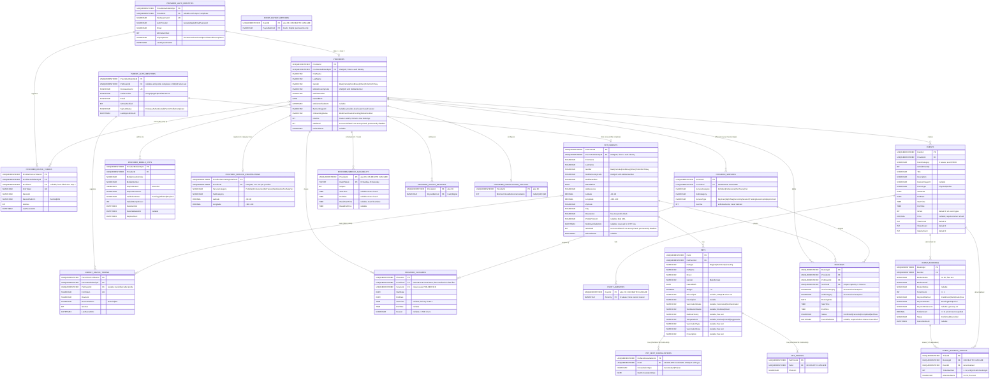

# Pawfront Database

SQL Server schema for Pawfront's structured (relational) data. Per-category
service offering details and event extension data live in **Cosmos DB**, not
here — see the API project's `docs/architecture.md` for the split.

Tables are organised into four schemas:

| Schema      | Purpose |
|-------------|---------|
| `Provider`  | Provider identity, profile, OTPs, devices, services, availability, closures, policies |
| `Parent`    | Pet-parent identity, Firebase auth identities, device tokens, `PetParents`, `Pets` |
| `Event`     | Provider-created events + amenities junction + ticket bookings |
| `Booking`   | Real bookings (per-service capacity-checked) |

> The legacy `Customer` schema (originally hosting `PetParents` and `Pets`)
> has been retired. `DeployAll.sql` transfers any existing `Customer.*`
> tables into `Parent.*` on first run and drops the empty schema.

Deployment is a single idempotent script:
[`Deployment/DeployAll.sql`](Deployment/DeployAll.sql). Re-runnable; uses
`IF NOT EXISTS` guards on tables/indexes and `CREATE OR ALTER` on sprocs.

## ER diagram


```mermaid
erDiagram
    PROVIDER_AUTH_IDENTITIES ||--o| PROVIDERS                    : "step 1 -> step 2"
    PROVIDER_AUTH_IDENTITIES ||--o{ PROVIDER_DEVICE_TOKENS       : "registers"
    PROVIDERS                |o--o{ PROVIDER_DEVICE_TOKENS       : "owns (after step 2)"
    PARENT_AUTH_IDENTITIES   ||--o| PET_PARENTS                  : "links once profile completes"
    PARENT_AUTH_IDENTITIES   ||--o{ PARENT_DEVICE_TOKENS         : "registers"
    PET_PARENTS              |o--o{ PARENT_DEVICE_TOKENS         : "owns (after profile)"
    PROVIDERS                ||--o{ PROVIDER_MOBILE_OTPS         : "verifies via"
    PROVIDERS                ||--o| PROVIDER_SERVICE_REGISTRATIONS : "registers (1 category max)"
    PROVIDERS                ||--o{ PROVIDER_SERVICES            : "offers (1 row per ServiceType)"
    PROVIDERS                ||--o{ PROVIDER_WEEKLY_AVAILABILITY : "schedules (0..7 rows)"
    PROVIDERS                ||--o{ PROVIDER_CLOSURES            : "closes"
    PROVIDER_SERVICES        ||--o{ PROVIDER_CLOSURES            : "scoped by"
    PROVIDERS                ||--o{ PROVIDER_PAYOUT_METHODS      : "configures"
    PROVIDERS                ||--o| PROVIDER_CANCELLATION_POLICIES : "configures"
    PROVIDERS                ||--o{ EVENTS                       : "creates"
    EVENTS                   ||--o{ EVENT_AMENITIES              : "lists"
    EVENTS                   ||--o{ EVENT_BOOKINGS               : "sells tickets for"
    EVENT_BOOKINGS           ||--o{ EVENT_BOOKING_TICKETS        : "issues (1..N attendees)"
    EVENTS                   ||--o{ EVENT_BOOKING_TICKETS        : "denormalised"
    PROVIDERS                ||--o{ BOOKINGS                     : "fulfills"
    PET_PARENTS              ||--o{ BOOKINGS                     : "places"
    PROVIDER_SERVICES        ||--o{ BOOKINGS                     : "targets"
    PET_PARENTS              ||--o{ PETS                         : "has"
    PETS                     ||--o{ PET_PHOTOS                   : "has (ON DELETE CASCADE)"
    PETS                     ||--o{ PET_NEXT_CONSULTATIONS       : "has (ON DELETE CASCADE)"

    PROVIDER_AUTH_IDENTITIES {
        UNIQUEIDENTIFIER ProviderAuthIdentityId PK
        UNIQUEIDENTIFIER ProviderId            FK "nullable until step 2 completes"
        NVARCHAR         FirebaseUserId        UK
        NVARCHAR         AuthProvider             "Google|Apple|EmailPassword"
        NVARCHAR         Email
        BIT              IsEmailVerified
        NVARCHAR         SignUpStatus             "FirebaseAuthenticated|ProviderProfileCompleted"
        DATETIME2        LastSignedInAtUtc
    }

    PROVIDERS {
        UNIQUEIDENTIFIER ProviderId             PK
        UNIQUEIDENTIFIER ProviderAuthIdentityId FK "UNIQUE; links to auth identity"
        NVARCHAR         FirstName
        NVARCHAR         LastName
        NVARCHAR         Gender                    "Male|Female|NonBinary|Other|PreferNotToSay"
        NVARCHAR         MobileCountryCode         "UNIQUE with MobileNumber"
        NVARCHAR         MobileNumber
        DATE             DateOfBirth
        DATETIME2        MobileVerifiedAtUtc       "nullable"
        NVARCHAR         BannerImageUrl            "nullable; provider-level search-card banner"
        NVARCHAR         OnboardingStatus          "MobileVerificationPending|MobileVerified"
        BIT              IsActive                  "master switch; 0 blocks new bookings"
        BIT              IsDeleted                 "account deleted: row anonymised, permanently disabled"
        DATETIME2        DeletedAtUtc              "nullable"
    }

    PROVIDER_DEVICE_TOKENS {
        UNIQUEIDENTIFIER ProviderDeviceTokenId  PK
        UNIQUEIDENTIFIER ProviderAuthIdentityId FK
        UNIQUEIDENTIFIER ProviderId             FK "nullable; back-filled after step 2"
        NVARCHAR         FcmToken               UK
        NVARCHAR         DeviceId
        NVARCHAR         DevicePlatform           "Android|iOS"
        BIT              IsActive
        DATETIME2        LastSeenAtUtc
    }

    PROVIDER_MOBILE_OTPS {
        UNIQUEIDENTIFIER ProviderMobileOtpId PK
        UNIQUEIDENTIFIER ProviderId          FK
        NVARCHAR         MobileCountryCode
        NVARCHAR         MobileNumber
        VARBINARY        OtpCodeHash            "SHA-256"
        NVARCHAR         OtpCodeLastTwo
        NVARCHAR         ValidationStatus       "Pending|Validated|Expired"
        INT              FailedAttemptCount
        DATETIME2        DateSentUtc
        DATETIME2        DateValidatedUtc       "nullable"
        DATETIME2        ExpiresAtUtc
    }

    PROVIDER_SERVICE_REGISTRATIONS {
        UNIQUEIDENTIFIER ProviderServiceRegistrationId PK
        UNIQUEIDENTIFIER ProviderId                    FK "UNIQUE; one row per provider"
        NVARCHAR         ServiceCategory                     "PetSitter|PetGroomer|PetTrainer|PetAdoptionAndSale|Vet"
        NVARCHAR         SubCategory
        DECIMAL          Latitude                            "-90..90"
        DECIMAL          Longitude                           "-180..180"
    }

    PROVIDER_SERVICES {
        UNIQUEIDENTIFIER ServiceId       PK
        UNIQUEIDENTIFIER ProviderId      FK   "ON DELETE CASCADE"
        NVARCHAR         ServiceCategory      "PetSitter|PetGroomer|PetTrainer|Vet"
        NVARCHAR         SubCategory
        NVARCHAR         ServiceType          "DayCare|NightStay|GroomingSession|TrainingSession|VetAppointment"
        BIT              IsActive             "soft-deactivate; never deleted"
    }

    PROVIDER_WEEKLY_AVAILABILITY {
        UNIQUEIDENTIFIER ProviderId      PK "also FK; ON DELETE CASCADE"
        TINYINT          DayOfWeek       PK "0=Sunday..6=Saturday"
        BIT              IsOpen
        TIME             StartTime          "nullable when closed"
        TIME             EndTime            "nullable when closed"
        TIME             BreakStartTime     "nullable; must fit window"
        TIME             BreakEndTime       "nullable"
    }

    PROVIDER_CLOSURES {
        UNIQUEIDENTIFIER ClosureId   PK
        UNIQUEIDENTIFIER ProviderId  FK    "ON DELETE CASCADE; denormalised for fast filter"
        UNIQUEIDENTIFIER ServiceId   FK    "closures are PER-SERVICE"
        DATE             StartDate
        DATE             EndDate
        TIME             StartTime         "nullable; full-day if NULL"
        TIME             EndTime           "nullable"
        NVARCHAR         Reason            "nullable; <=500 chars"
    }

    PROVIDER_PAYOUT_METHODS {
        UNIQUEIDENTIFIER ProviderId    PK "also FK"
        NVARCHAR         PayoutMethod  PK "Cash|Digital"
    }

    PROVIDER_CANCELLATION_POLICIES {
        UNIQUEIDENTIFIER ProviderId                    PK "also FK"
        INT              MinimumHoursBeforeCancellation    "null|24|48|72|96"
    }

    PARENT_AUTH_IDENTITIES {
        UNIQUEIDENTIFIER ParentAuthIdentityId PK
        UNIQUEIDENTIFIER PetParentId          FK "nullable until profile completes; UNIQUE when set"
        NVARCHAR         FirebaseUserId       UK
        NVARCHAR         AuthProvider             "Google|Apple|EmailPassword"
        NVARCHAR         Email
        BIT              IsEmailVerified
        NVARCHAR         SignUpStatus             "FirebaseAuthenticated|ParentProfileCompleted"
        DATETIME2        LastSignedInAtUtc
    }

    PARENT_DEVICE_TOKENS {
        UNIQUEIDENTIFIER ParentDeviceTokenId  PK
        UNIQUEIDENTIFIER ParentAuthIdentityId FK
        UNIQUEIDENTIFIER PetParentId          FK "nullable; back-filled after profile"
        NVARCHAR         FcmToken             UK
        NVARCHAR         DeviceId
        NVARCHAR         DevicePlatform           "Android|iOS"
        BIT              IsActive
        DATETIME2        LastSeenAtUtc
    }

    PET_PARENTS {
        UNIQUEIDENTIFIER PetParentId          PK
        UNIQUEIDENTIFIER ParentAuthIdentityId FK "UNIQUE; links to auth identity"
        NVARCHAR         FirstName
        NVARCHAR         LastName
        NVARCHAR         Gender                    "Male|Female|NonBinary|Other|PreferNotToSay"
        NVARCHAR         MobileCountryCode         "UNIQUE with MobileNumber"
        NVARCHAR         MobileNumber
        DATE             DateOfBirth
        NVARCHAR         AddressLine
        DECIMAL          Latitude                  "-90..90"
        DECIMAL          Longitude                 "-180..180"
        NVARCHAR         ZipCode
        NVARCHAR         City
        NVARCHAR         Description               "free-text profile blurb"
        NVARCHAR         ProfilePhotoUrl           "nullable; blob URL"
        DATETIME2        MobileVerifiedAtUtc       "nullable; reserved for OTP flow"
        BIT              IsDeleted                 "account deleted: row anonymised, permanently disabled"
        DATETIME2        DeletedAtUtc              "nullable"
    }

    PETS {
        UNIQUEIDENTIFIER PetId       PK
        UNIQUEIDENTIFIER PetParentId FK
        NVARCHAR         PetType         "Dog|Cat|Hamster|GuineaPig"
        NVARCHAR         PetName
        NVARCHAR         Breed
        NVARCHAR         Gender          "Male|Female"
        DATE             DateOfBirth
        DECIMAL          Weight          "> 0"
        NVARCHAR         MicrochipId         "nullable; UNIQUE when set"
        NVARCHAR         Description         "nullable"
        NVARCHAR         VaccinationStatus   "nullable; Vaccinated|NotVaccinated"
        NVARCHAR         SterilizationStatus "nullable; Sterilized|Intact"
        NVARCHAR         MedicalHistory      "nullable; free text"
        NVARCHAR         Temperament         "nullable; Anxious|Friendly|Aggressive"
        NVARCHAR         VaccinationType     "nullable; free text"
        NVARCHAR         VaccinationDose     "nullable; free text"
        NVARCHAR         Prescription        "nullable; free text"
    }

    PET_PHOTOS {
        UNIQUEIDENTIFIER PetPhotoId PK
        UNIQUEIDENTIFIER PetId      FK    "ON DELETE CASCADE"
        NVARCHAR         PhotoUrl
    }

    PET_NEXT_CONSULTATIONS {
        UNIQUEIDENTIFIER PetNextConsultationId PK
        UNIQUEIDENTIFIER PetId                 FK "ON DELETE CASCADE; UNIQUE with type"
        NVARCHAR         ConsultationType         "Groomer|Vet|Trainer"
        DATE             NextConsultationDate
    }

    EVENTS {
        UNIQUEIDENTIFIER EventId         PK
        UNIQUEIDENTIFIER ProviderId      FK
        NVARCHAR         EventCategory       "8 values; see CHECK"
        BIT              IsChildFriendly
        NVARCHAR         Title
        NVARCHAR         Description
        NVARCHAR         BannerImageUrl      "nullable"
        NVARCHAR         EventType           "Physical|Online"
        DATE             StartDate
        DATE             EndDate
        TIME             StartTime
        TIME             EndTime
        BIT              IsPaid              "default 0; all event types"
        DECIMAL          Price               "nullable; required when IsPaid"
        INT              ViewCount           "default 0"
        INT              ShareCount          "default 0"
        INT              InquiryCount        "default 0"
    }

    EVENT_AMENITIES {
        UNIQUEIDENTIFIER EventId PK "also FK; ON DELETE CASCADE"
        NVARCHAR         Amenity PK "8 values; None cannot coexist"
    }

    EVENT_PAYOUT_METHODS {
        UNIQUEIDENTIFIER EventId      PK "also FK; ON DELETE CASCADE"
        NVARCHAR         PayoutMethod PK "Cash | Digital; paid events only"
    }

    EVENT_BOOKINGS {
        UNIQUEIDENTIFIER BookingId        PK
        UNIQUEIDENTIFIER EventId          FK
        NVARCHAR         BookerName            "no FK; free text"
        NVARCHAR         BookerEmail
        NVARCHAR         BookerMobile          "nullable"
        INT              TicketCount           ">= 1"
        NVARCHAR         PaymentMethod         "CreditCard|Twint|Cash|Free"
        NVARCHAR         PaymentStatus         "Pending|Paid|Failed"
        NVARCHAR         PaymentReference      "nullable; gateway ref"
        DECIMAL          TotalAmount           ">= 0; price*count snapshot"
        NVARCHAR         Status                "Confirmed|Cancelled"
        DATETIME2        CancelledAtUtc        "nullable"
    }

    EVENT_BOOKING_TICKETS {
        UNIQUEIDENTIFIER TicketId      PK
        UNIQUEIDENTIFIER BookingId     FK "ON DELETE CASCADE"
        UNIQUEIDENTIFIER EventId       FK "denormalised"
        INT              TicketNumber     "1..N; UNIQUE with BookingId"
        NVARCHAR         AttendeeName     "no FK; free text"
    }

    BOOKINGS {
        UNIQUEIDENTIFIER BookingId       PK
        UNIQUEIDENTIFIER ProviderId      FK
        UNIQUEIDENTIFIER PetParentId     FK
        UNIQUEIDENTIFIER ServiceId       FK   "scopes capacity + closures"
        NVARCHAR         ServiceCategory      "denormalised snapshot"
        NVARCHAR         SubCategory          "denormalised snapshot"
        DATE             BookingDate
        TIME             StartTime
        TIME             EndTime
        NVARCHAR         Status               "Confirmed|Cancelled|Completed|NoShow"
        DATETIME2        CancelledAtUtc       "nullable; required when Status=Cancelled"
    }
```

> The diagram renders inline on GitHub, Azure DevOps, GitLab, and any
> Mermaid-aware markdown viewer (VS Code with the Markdown All in One
> extension, IntelliJ, Obsidian, etc.). It is intentionally text-based so
> the schema stays version-controlled with the SQL.

## Provider schema

### `Provider.ProviderAuthIdentities`
Firebase-authenticated sign-up row, created BEFORE the provider has filled
in personal details. The Pawfront API verifies the Firebase ID token and
upserts on `FirebaseUserId`.

- `ProviderAuthIdentityId` — PK for step 1.
- `ProviderId` — nullable until step 2 (`Provider.CompleteProviderProfile`) runs.
- `FirebaseUserId` — Firebase UID, globally unique.
- `AuthProvider` — `Google`, `Apple`, or `EmailPassword`.
- `FirebaseProviderId`, `FirebaseTenantId` — optional raw Firebase metadata.
- `Email`, `IsEmailVerified`, `DisplayName`, `FirebasePhoneNumber`, `PhotoUrl`.
- `SignUpStatus` — `FirebaseAuthenticated` or `ProviderProfileCompleted`.
- `LastSignedInAtUtc`, `CreatedAtUtc`, `UpdatedAtUtc`.

### `Provider.Providers`
The main provider entity. `ProviderId` is the primary correlation key used
throughout the application.

- `ProviderId` — PK.
- `ProviderAuthIdentityId` — UNIQUE FK back to step 1.
- `FirstName`, `LastName`, `Gender` (CHECK list).
- `MobileCountryCode`, `MobileNumber` — UNIQUE together.
- `DateOfBirth`.
- `MobileVerifiedAtUtc` — populated after OTP validation.
- `OnboardingStatus` — `MobileVerificationPending` → `MobileVerified`.
- `BannerImageUrl` — nullable; the provider-level search-card banner.
- `IsActive` — master Active/Inactive switch. When 0, `Booking.CreateBooking`
  rejects every new booking on any of this provider's services.
- `IsDeleted`, `DeletedAtUtc` — set by `Provider.DeleteProvider`, which
  implements "Delete account" as an **anonymise + permanently disable** rather
  than a row delete, so bookings, events and the payment ledger keep their
  meaning. When `IsDeleted = 1` the personal fields hold placeholders (the name
  is `Deleted Provider`), `IsActive` is forced to 0, and both reactivation and
  profile edits are refused (THROW 51115). Distinct from a plain `IsActive = 0`
  toggle, which is reversible.

### `Provider.ProviderPhotos`
General provider photo gallery (not tied to a service). One row per uploaded
image — a provider can have many photos. Inserted by
`POST /api/v1/providers/{providerId}/photos` (multipart) via sproc
`Provider.AddProviderPhoto`; listed via `Provider.ListProviderPhotos`; removed
one-by-one via `Provider.DeleteProviderPhoto`.

- `ProviderPhotoId` — PK.
- `ProviderId` — FK → `Provider.Providers`, `ON DELETE CASCADE` (deleting a
  provider removes its photo rows; blobs themselves cleaned up best-effort).
- `PhotoUrl` — NVARCHAR(1000), the blob URL in the `provider-photos` folder
  of the shared `provider-images` container.
- `CreatedAtUtc` — upload timestamp.

### `Provider.ProviderDeviceTokens`
FCM device tokens captured at sign-in. Linked to the auth identity first;
back-filled with `ProviderId` once the profile is completed.

- `ProviderDeviceTokenId` — PK.
- `ProviderAuthIdentityId` — required FK.
- `ProviderId` — nullable FK.
- `FcmToken` — UNIQUE.
- `DeviceId`, `DevicePlatform` (`Android`|`iOS`), `IsActive`, `LastSeenAtUtc`.

### `Provider.ProviderMobileOtps`
Mobile OTP send + validation log. OTP codes are stored as SHA-256 hashes.

- `ProviderMobileOtpId` — PK returned to the client.
- `ProviderId` — FK.
- `MobileCountryCode`, `MobileNumber` — snapshot at send time.
- `OtpCodeHash` — `VARBINARY(32)`.
- `OtpCodeLastTwo` — display hint.
- `ValidationStatus` — `Pending`, `Validated`, or `Expired`.
- `FailedAttemptCount`.
- `DateSentUtc`, `DateValidatedUtc`, `ExpiresAtUtc`.

### `Provider.ProviderServiceRegistrations`
Geo-indexed registration row pinning the provider to **one** service
category. A `UNIQUE (ProviderId)` constraint enforces the
"one-service-per-provider" rule — attempting to register a second category
throws `THROW 51011` (mapped to `409 ServiceCategoryConflict`).

- `ProviderServiceRegistrationId` — PK.
- `ProviderId` — UNIQUE FK.
- `ServiceCategory` — `PetSitter`, `PetGroomer`, `PetTrainer`,
  `PetAdoptionAndSale`, or `Vet`.
- `SubCategory` — category-specific (e.g. `PetHotel`, `FreelancePetSitter`).
- `Latitude`, `Longitude` — geo filter index for discovery.

### `Provider.ProviderServices`
The per-service catalog — **one row per (provider, ServiceType)**.
Upserted automatically when a provider saves an offering: PetSitter with
both DayCare and NightStay produces two rows. Closures, bookings, and slot
queries all reference a specific `ServiceId` from this table. Rows are
**soft-deactivated** (`IsActive = 0`) rather than deleted, so historical
closures/bookings retain referential integrity.

- `ServiceId` — PK; minted on first upsert.
- `ProviderId` — FK with `ON DELETE CASCADE`.
- `ServiceCategory` — `PetSitter`, `PetGroomer`, `PetTrainer`, or `Vet`
  (PetAdoptionAndSale has no offering and no rows here).
- `SubCategory` — denormalised for read convenience.
- `ServiceType` — one of `DayCare`, `NightStay`, `GroomingSession`,
  `TrainingSession`, `VetAppointment`. Compatible with `ServiceCategory`
  via a check constraint.
- `IsActive`.
- UNIQUE `(ProviderId, ServiceType)`.

### `Provider.ProviderWeeklyAvailability`
Seven-day recurring schedule. Composite PK `(ProviderId, DayOfWeek)`.
Cascading delete from `Providers`.

- `DayOfWeek` — `TINYINT 0..6` (`0 = Sunday`).
- `IsOpen` — when `false`, all time columns must be NULL (CHECK).
- `StartTime`, `EndTime` — required when `IsOpen = true`.
- `BreakStartTime`, `BreakEndTime` — optional single break, must lie inside
  `[StartTime, EndTime]`.

### `Provider.ProviderClosures`
Per-service vacation / sick-leave windows. A closure on DayCare does **not**
block NightStay slots/bookings.

- `ClosureId` — PK.
- `ProviderId` — FK with `ON DELETE CASCADE` (denormalised for fast
  filter; the source of truth is `ServiceId`).
- `ServiceId` — FK → `ProviderServices`.
- `StartDate`, `EndDate` — `EndDate >= StartDate`.
- `StartTime`, `EndTime` — both NULL = full-day closure across the range;
  both set requires `StartDate = EndDate` (partial-day on one day).
- `Reason` — optional, ≤500 chars.

### `Provider.ProviderPayoutMethods`
Junction. A provider can enable `Cash`, `Digital`, both, or neither.

- PK `(ProviderId, PayoutMethod)`.
- `PayoutMethod` — `Cash` or `Digital` (CHECK).

### `Provider.ProviderCancellationPolicies`
One row per provider. Nullable cancellation window.

- `ProviderId` — PK + FK.
- `MinimumHoursBeforeCancellation` — `NULL`, `24`, `48`, `72`, or `96` (CHECK).

## Parent schema

### `Parent.ParentAuthIdentities`
Pet-parent Firebase login identity. One row per Firebase user. Created on
the first call to `POST /api/v1/parent-onboarding/firebase-auth`; the row
is updated on every subsequent login (refreshes display name, photo, etc.)
via `Parent.SaveParentAuthIdentity` (`UPDLOCK + HOLDLOCK` on the lookup).

- `ParentAuthIdentityId` — PK.
- `PetParentId` — nullable FK → `Parent.PetParents`. Stays null until the
  parent completes the profile step (not yet built). Unique when set.
- `FirebaseUserId` — UNIQUE; from the `user_id`/`sub` claim.
- `AuthProvider` — `Google`, `Apple`, or `EmailPassword` (CHECK).
- `Email` (always populated from the JWT), `IsEmailVerified`, `DisplayName`,
  `FirebasePhoneNumber`, `PhotoUrl`, `FirebaseTenantId`, `FirebaseProviderId`.
- `SignUpStatus` — `FirebaseAuthenticated` → `ParentProfileCompleted`
  (CHECK). Flipped when the parent profile endpoint lands.
- `LastSignedInAtUtc`, `CreatedAtUtc`, `UpdatedAtUtc`.

### `Parent.ParentDeviceTokens`
FCM tokens per device for the pet-parent app. Many tokens per parent (one
per device). Same upsert path as `Provider.ProviderDeviceTokens`: the same
`FcmToken` value updates the row in place; a new value inserts.

- `ParentDeviceTokenId` — PK.
- `ParentAuthIdentityId` — FK → `Parent.ParentAuthIdentities`.
- `PetParentId` — nullable FK → `Parent.PetParents`. Backfilled when the
  parent's profile is created.
- `FcmToken` — UNIQUE; up to 2048 chars.
- `DeviceId`, `DevicePlatform` (`Android` or `iOS`, CHECK).
- `IsActive`, `LastSeenAtUtc`, timestamps.

### `Parent.PetParents`
Pet-parent profile row. Created by `POST /api/v1/parent-onboarding/profile`
(sproc `Parent.CompletePetParentProfile`), one per `ParentAuthIdentityId`.
Idempotent — if the auth identity already has a `PetParentId`, the sproc
returns the existing row without re-inserting. Booking creation FKs to
this table, so a profile must exist before any booking can be placed.

- `PetParentId` — PK.
- `ParentAuthIdentityId` — UNIQUE + FK → `Parent.ParentAuthIdentities`.
  Links the profile back to the Firebase login.
- `FirstName`, `LastName`, `Gender` (5-value CHECK: `Male`, `Female`,
  `NonBinary`, `Other`, `PreferNotToSay`).
- `MobileCountryCode` + `MobileNumber` — UNIQUE composite. Plus a nullable
  `MobileVerifiedAtUtc` reserved for the eventual OTP flow.
- `DateOfBirth`.
- `AddressLine`, `Latitude`, `Longitude` (CHECK -90..90 / -180..180,
  `DECIMAL(9,6)`), `ZipCode`, `City`.
- `Description` (NVARCHAR(2000)) — free-text profile blurb captured at
  registration.
- `ProfilePhotoUrl` — nullable, NVARCHAR(1000). Set by
  `POST /api/v1/pet-parents/{petParentId}/profile-image` via the sproc
  `Parent.UpdatePetParentProfilePhoto`. The blob itself lives under
  `pet-parent-profile-photos/<petParentId>/<guid>.<ext>` in the shared
  `provider-images` container.
- `IsDeleted`, `DeletedAtUtc` — set by `Parent.DeletePetParent`, which
  implements "delete account" as an **anonymise + permanently disable**, never a
  row delete: the `PetParentId` has to keep its meaning for the bookings, events
  and payments that reference it — and those belong to the **provider** as much
  as to the parent. When `IsDeleted = 1` the personal fields hold placeholders
  (name `Deleted User`, a mobile derived from the `PetParentId`, address
  `Deleted`), the parent's pets are anonymised alongside, and the Firebase link
  on `Parent.ParentAuthIdentities` is scrubbed — which frees the real uid AND
  the real mobile number, so the person can sign up again and gets a brand-new
  `PetParentId`. `IsDeleted` also blocks profile edits (THROW `51224`), since an
  edit would undo the anonymisation.
- Timestamps.

> Legacy `Parent.PetParents` rows (predating the profile schema) survive
> the migration with nullable profile columns. New rows always have every
> field populated because the sproc requires them.

### `Parent.Pets`
Pets owned by a parent. One row per pet; a parent can have many. Inserted
by `POST /api/v1/pet-parents/{petParentId}/pets` (sproc
`Parent.AddPetParentPet`).

- `PetId` — PK.
- `PetParentId` — FK → `Parent.PetParents`.
- `PetType` — `Dog`, `Cat`, `Hamster`, or `GuineaPig` (CHECK).
- `PetName`, `Breed`.
- `Gender` — `Male` or `Female` (CHECK).
- `DateOfBirth`.
- `Weight` — `DECIMAL(5,2)`, CHECK > 0. Unit is implicit (kg).
- `MicrochipId` — nullable. UNIQUE filtered index (NULLs allowed to coexist).
  Microchip ids are globally unique per ISO 11784/11785, so collisions
  across pet parents return 409 `MicrochipIdAlreadyExists`.
- `Description` — nullable free-text.
- `VaccinationStatus` — nullable, `Vaccinated | NotVaccinated` (CHECK).
  Populated by `PATCH /pets/{petId}/medical-info`.
- `SterilizationStatus` — nullable, `Sterilized | Intact` (CHECK). Same
  PATCH endpoint. "Sterilized" covers both neuter (male) and spay (female);
  the mobile client renders it as "Neutered/Spayed".
- `MedicalHistory` — nullable NVARCHAR(MAX). Free text.
- `Temperament` — nullable, `Anxious | Friendly | Aggressive` (CHECK).
- `VaccinationType` / `VaccinationDose` / `Prescription` — nullable free text
  (NVARCHAR(100) / NVARCHAR(64) / NVARCHAR(MAX)). Same PATCH endpoint; also
  joined into the booking-detail `petDetails` section (with `Breed` and
  `VaccinationStatus`) by `Booking.GetBookingDetail` /
  `Booking.GetNightStayBookingDetail`.

### `Parent.PetPhotos`
Pet photos (gallery). One row per uploaded image — a pet can have many
photos. Inserted by `POST /api/v1/pets/{petId}/photos` (multipart) via
sproc `Parent.AddPetPhoto`.

- `PetPhotoId` — PK.
- `PetId` — FK → `Parent.Pets`, `ON DELETE CASCADE` (deleting a pet
  removes its photo rows; blobs themselves are not cleaned up).
- `PhotoUrl` — NVARCHAR(1000), the blob URL in the `pet-photos`
  folder of the shared `provider-images` container.
- Timestamps.

### `Parent.PetNextConsultations`
A pet's next-consultation dates, one row per provider type (`Groomer | Vet |
Trainer`) — UNIQUE(`PetId`, `ConsultationType`); a newer date from the same
type replaces the old one. Written by the provider's booking-complete flow
(`POST /providers/{providerId}/bookings/{bookingId}/complete` with the
optional `nextConsultationDate` body field) via sproc
`Parent.UpsertPetNextConsultation` (THROW 51221 pet not found). Read back on
the pet endpoints (result set 3 of `Parent.GetPetParentPet` /
`Parent.ListPetParentPets`) as `nextConsultations: [{ type, nextConsultation }]`.
`ON DELETE CASCADE` with the pet.

### `Parent.PetParentPhotos`
General pet-parent photo gallery (not tied to a pet). One row per uploaded
image — a parent can have many photos. Inserted by
`POST /api/v1/pet-parents/{petParentId}/photos` (multipart) via sproc
`Parent.AddPetParentPhoto`; listed via `Parent.ListPetParentPhotos`; removed
one-by-one via `Parent.DeletePetParentPhoto`.

- `PetParentPhotoId` — PK.
- `PetParentId` — FK → `Parent.PetParents`, `ON DELETE CASCADE` (deleting a
  parent removes its photo rows; blobs themselves cleaned up best-effort).
- `PhotoUrl` — NVARCHAR(1000), the blob URL in the `pet-parent-photos` folder
  of the shared `provider-images` container.
- `CreatedAtUtc` — upload timestamp.

## Event schema

### `Event.Events`
Provider-created events (adoption drives, training sessions, charity,
etc.). Physical-event extension data (**capacity only**) lives in
**Cosmos** (`Events` container), keyed by the same `EventId`. Online events
have no Cosmos doc. **Ticketing (`IsPaid`/`Price`) lives on this SQL row,
not Cosmos**, so it's returned for every event type — online events can be
paid too.

- `EventId` — PK.
- `ProviderId` — FK.
- `EventCategory` — one of 8 values: `AdoptionAndRescue`, `PetTraining`,
  `Charity`, `Volunteering`, `HealthAndWellness`, `SocialAndCultural`,
  `OutdoorActivities`, `ParentEducation`.
- `IsChildFriendly`.
- `Title`, `Description` (NVARCHAR(MAX)), `BannerImageUrl` (nullable).
- `EventType` — `Physical` or `Online`.
- `StartDate <= EndDate` (CHECK), `StartTime`, `EndTime`.
- `IsPaid` (default 0) / `Price` (nullable DECIMAL(18,2)) — ticketing for any
  event type. `CK_Events_Ticketing` enforces `Price IS NULL` for free events
  and a non-negative `Price` for paid ones.
- `ViewCount`, `ShareCount`, `InquiryCount` — engagement counters
  ("PawPrints"). Default 0; atomically incremented by
  `Event.IncrementEventCounter` from the three public increment
  endpoints. Read in `Event.GetEventMetrics`, and surfaced read-only on
  every event read (all five event-returning sprocs append them to
  result set 1) under a `pawPrints` object on the API's `EventResponse`.

### `Event.EventAmenities`
Junction listing the venue amenities for an event.

- PK `(EventId, Amenity)` with `ON DELETE CASCADE`.
- `Amenity` — one of `FreeParking`, `PaidParking`, `Restrooms`,
  `DrinkingWater`, `FoodAndBeverage`, `SeatingAreas`, `FirstAidBooth`,
  `None`. The C# layer rejects `None` together with any other amenity.

### `Event.EventPayoutMethods`
Junction listing how the event organiser wants ticket proceeds paid out.
Written by `Event.SaveEventPayoutMethods` (`POST /events/{eventId}/payout-methods`).

- PK `(EventId, PayoutMethod)` with `ON DELETE CASCADE`.
- `PayoutMethod` — `Cash` or `Digital` (one or more rows per event).
- **Paid events only** — the sproc throws `51099` for a free event
  (`IsPaid = 0`) and `51098` when the event id is unknown.

### `Event.EventBookings`
Ticket purchases against a physical event. **Booker identity is free text**
— anyone with a Firebase login can buy tickets for any names. There is no
FK to `Parent.PetParents`. Capacity is enforced inside
`Event.CreateEventBooking` by SUMming `TicketCount` over confirmed rows for
the event under `UPDLOCK + HOLDLOCK`.

- `BookingId` — PK.
- `EventId` — FK → `Event.Events`.
- `BookerName`, `BookerEmail`, `BookerMobile` — free text; the contact for
  the buyer of the tickets.
- `TicketCount` — denormalised count of child ticket rows; feeds the
  race-safe capacity check.
- `PaymentMethod` — `CreditCard`, `Twint`, `Cash`, or `Free` (CHECK).
  `CreditCard`/`Twint` settle on an external gateway; `Cash` is collected
  in person and `Free` carries no charge.
- `PaymentStatus` — `Pending`, `Paid`, or `Failed`. Created as `Pending`;
  flipped by the gateway callback (`Event.ConfirmEventBookingPayment`).
- `PaymentReference` — external gateway reference, populated on callback.
- `TotalAmount` — snapshot of `price × TicketCount` at booking time; 0 for
  free events.
- `Status` — `Confirmed` or `Cancelled`. `Cancelled` requires
  `CancelledAtUtc` (CHECK). Cancellation/refund flow is not built yet.

### `Event.EventBookingTickets`
One row per attendee / printed ticket. The GET endpoint returns one entry
per row here — if 4 tickets were bought, 4 rows come back.

- `TicketId` — PK.
- `BookingId` — FK with `ON DELETE CASCADE`.
- `EventId` — denormalised so per-event listings don't need a join back.
- `TicketNumber` — 1..N within the booking; UNIQUE with `BookingId`.
- `AttendeeName` — free text, not validated against any user table.

## Booking schema

### `Booking.Bookings`
Confirmed booking records, scoped by `ServiceId`. Capacity check + insert
is race-safe inside `Booking.CreateBooking` (UPDLOCK + HOLDLOCK on the
overlap-count query). The same locked range also rejects a **duplicate booking
for the same pet** — an active booking on this service overlapping the requested
window (same `PetId`) → `51069` (409 `PetAlreadyBooked`). Only fires when the
create names a `PetId`; Custom walk-ins are unaffected. The night-stay twin uses
`51239` (overlapping date range).

- `BookingId` — PK.
- `JobNumber` — `INT IDENTITY`, UNIQUE. Short sequential number rendered as the
  human-friendly Job ID (`PF-000123`) on the booking-detail read. The GUID
  `BookingId` stays the API/route identity.
- `ProviderId` — FK.
- `PetParentId` — FK.
- `ServiceId` — FK → `ProviderServices`. **All capacity and closure logic
  is scoped by this column.** DayCare and NightStay each get an
  independent capacity bucket.
- `ServiceCategory`, `SubCategory` — denormalised snapshot so historical
  bookings remain meaningful even if the provider deregisters or changes
  sub-category.
- `BookingDate`, `StartTime`, `EndTime` — `StartTime < EndTime` (CHECK).
- `Status` — expanded "job" lifecycle: `CREATED` → `CONFIRMED` →
  `START_JOB` → `IN_PROGRESS` → `COMPLETED` → `PAID` (the provider taps "Start Job" →
  `START_JOB` (start-OTP issued to the parent), enters the parent's start-code →
  `IN_PROGRESS`, marks the job done → `COMPLETED` (no OTP), then records the parent's
  payment → `PAID` (writes a `Booking.BookingPayments` row; App bookings only);
  `JOB_STARTED` (the single direct-start state) and `ENDING` (the retired "End Job"
  end-OTP state) are kept in the CHECK list for legacy rows), plus the modification statuses,
  `APPROVAL_NEEDED` (deprecated, legacy rows), the two terminal cancel
  states `PROVIDER_CANCELLED` / `PARENT_CANCELLED` (which require
  `CancelledAtUtc`, CHECK), the two terminal no-show states
  `PARENT_NO_SHOW` / `PROVIDER_NO_SHOW` (the named party failed to appear;
  reportable by the counterparty 30+ minutes after the scheduled start —
  **night stays use 2+ hours after `CheckInDate + DropOffTime` instead. Both
  kinds also settle automatically once the job's moment has passed with it still
  unstarted — single-day at the end of the PROVIDER'S WORKING DAY on the booking
  date (their closing time from `Provider.ProviderWeeklyAvailability`, or the
  booking's own `EndTime` if that falls later; midnight UTC when no hours are
  saved), night stays at midnight UTC on the check-in day:
  `START_JOB` → `PARENT_NO_SHOW`, confirmed-equivalent → `PROVIDER_NO_SHOW`**),
  the
  terminal `EXPIRED` state (sat in `CREATED` for 24+ hours without the
  provider accepting — written by the scheduled external job; never by a client),
  the terminal
  `JOB_EXPIRED` state (**legacy as of 2026-07-29, no longer produced** — the
  provider accepted but the job never reached `IN_PROGRESS` and the scheduled
  window fully elapsed; that now settles as a no-show above, so the status
  survives only on existing rows; distinct from `EXPIRED`), and the terminal
  `OTP_MAX_ATTEMPTS_EXCEEDED` state (the provider
  entered the wrong start-code 6 times, cancelling the job; set by
  `Booking.VerifyBookingStartOtp` + night-stay mirror; never by a client — a
  status of its own, rather than a plain cancellation, so both apps can label it
  "OTP Max Attempts Exceeded". Renamed 2026-07-25 from `OTP_ATTEMPTS_EXCEEDED`;
  `DeployAll.sql` migrates existing rows and audit entries).
  New app bookings default to `CREATED`; custom walk-ins start `CONFIRMED`.
  **Time-driven settlement lives OUTSIDE this database (2026-08-02).** `EXPIRED`,
  the two auto-settled no-shows, and the expired-parent-modification revert are
  written by a **scheduled external job**; the `Booking.ExpireStaleBookings`
  sproc that used to do it every 10 minutes (via an in-process hosted service in
  both API hosts) is **dropped** by `DeployAll.sql`. No sproc here changes a
  booking's status on the basis of elapsed time any more. The time checks that
  remain — `UpdateBookingStatus` / `UpdateNightStayBookingStatus` (THROW 51129 /
  51249) and `RespondBookingModification` / `RespondNightStayBookingModification`
  (THROW 51152 / 51272) — **reject a late transition without writing anything**,
  so between job runs a row can legitimately still read `CREATED` (or sit in
  `MODIFICATION_REQUEST_BY_PARENT`) while the API already refuses to act on it.
  **A booking holds its capacity slot in every status except the two
  cancelled ones, `PROVIDER_DECLINED`, the two no-show statuses, `EXPIRED`,
  `JOB_EXPIRED`, and `OTP_MAX_ATTEMPTS_EXCEEDED`** — that's the predicate every
  capacity / closure-conflict / active-status / slot query uses. (`PAID` and
  `COMPLETED` both **hold** the slot and both count as a completed booking.)
- `PricePerHour` — snapshot of the offering's unit rate captured at booking
  time (price-lock). Populated for App bookings now (previously Custom-only — the
  `CK_Bookings_SourceShape` App-must-be-NULL clause was relaxed to allow it); the
  booking-detail read prices off it so a later rate change never re-prices an
  existing booking. NULL only for legacy rows (detail falls back to the live rate).
- `CancellationPolicyHours` — snapshot of the provider's advertised cancellation
  policy at booking time (`NULL | 24 | 48 | 72 | 96`; CHECK). Frozen so a later
  policy change never re-rules an existing booking; resolved in the create sproc
  from `Provider.ProviderCancellationPolicies`. NULL legitimately = "no restriction".
- `Snapshot{AddressLine, City, ZipCode, Latitude, Longitude}` — snapshot of the
  **selected** service-location address at booking time (`LocationType`-driven:
  the parent's profile address for `ParentLocation`, the provider's business
  address for `ProviderLocation`). Frozen so a later address edit never moves an
  existing booking; the detail read prefers these and falls back to live resolution
  only for legacy rows (all-NULL). NULL for Custom walk-ins.
- `PayoutStatus` — `Pending` / `Processing` / `Paid` / `Failed` (CHECK),
  default `Pending`. Capture-only for now — the actual provider-payout
  execution leg is not built yet.
- `PayoutId` — external payout reference; NULL until a payout is issued.
- Customer/pet detail for **App** bookings is NOT stored here (those columns
  are Custom-walk-in only) — the booking-detail read
  (`Booking.GetBookingDetail`) LEFT JOINs `Parent.PetParents` + `Parent.Pets`
  to surface customer + pet info, and price is computed live from the
  provider's offering.

### `Booking.BookingStatusHistory`
Append-only audit trail of every status change on a booking. One row per
transition (plus a seeded creation row with `FromStatus = NULL`). Written
atomically with the status update by `Booking.UpdateBookingStatus`,
`Booking.CancelBooking`, and the two create sprocs.

- `BookingStatusHistoryId` — PK.
- `BookingId` — FK → `Booking.Bookings`, `ON DELETE CASCADE`.
- `FromStatus` — NULL only for the creation entry.
- `ToStatus` — the new status.
- `ChangedByActor` — `Provider`, `Parent`, or `System` (CHECK).
- `ChangedByActorId` — the ProviderId / PetParentId; NULL for System rows.
- `Note` — optional free-text reason.
- `ChangedAtUtc` — when the change happened.

### Job-lifecycle tables (single-day + night-stay twins)
The expanded "job" lifecycle adds three child tables per booking entity
(`Booking.Bookings` and `Booking.NightStayBookings`), each `ON DELETE CASCADE`
from its parent. The night-stay twin names are prefixed `NightStay…`.

- **`Booking.BookingStartOtps`** — telemetry of every start-OTP issued for a
  booking: the code is issued at `START_JOB` and consumed by
  `VerifyBookingStartOtp` → `IN_PROGRESS` (completion needs no OTP).
  `{ OtpCode NVARCHAR(6) (plaintext low-secrecy share code),
  Status (Pending|Consumed|Expired), FailedAttemptCount, IssuedAtUtc, ExpiresAtUtc,
  ConsumedAtUtc }`. Issued/reused by `IssueBookingStartOtp` (reuse-while-valid);
  also issued inline by `StartBooking`.
- **`Booking.BookingEvidence`** — one row per job-completion photo
  (`PhotoUrl`, `CreatedAtUtc`); optional — `COMPLETED` no longer requires
  evidence. Same shape as `Provider.ProviderPhotos`.
- **`Booking.BookingModifications`** — **staging area** for the single open
  date/time-change proposal (UNIQUE per booking; **date/time only**).
  `{ RequestedByActor, RequestedByActorId, ProposedBookingDate/StartTime/EndTime
  (single-day) | ProposedCheckInDate/CheckOutDate (night-stay), RequestNote,
  CreatedAtUtc }`. The row is **DELETED** when the proposal is resolved — accept
  copies the staged values onto the booking row first ("staging → main"), decline
  just discards. Driven by `RequestBookingModification` /
  `RespondBookingModification`; read via `GetPendingBookingModification`.
  A proposal from **either party** is time-boxed (2026-07-31; widened to the
  provider side 2026-08-02 — previously parent-only): it can only be opened up to
  2 hours before the service starts (`BookingDate + StartTime`, or
  `CheckInDate + DropOffTime` for a stay — THROW 51151 / 51271), and one still
  unanswered at that cutoff expires — the staging row is discarded and the booking
  **reverts to `CONFIRMED`**, done by the scheduled external job
  (`Booking.RevertExpiredModificationRequests`, which captures each row's actual
  prior status since it can now be either `MODIFICATION_REQUEST_BY_PARENT` or
  `..._BY_PROVIDER`). The respond sprocs only **reject** a response that arrives
  past the cutoff (THROW 51152 / 51272); they no longer perform the revert
  themselves, so until that job runs the booking stays parked in whichever
  `MODIFICATION_REQUEST_BY_*` status it was in.
  It also stages the **acknowledged terms** (2026-07-27):
  `{ HasAcknowledgedTerms, AcknowledgedPricePerHour (single-day) |
  AcknowledgedPricePerNight + AcknowledgedDropOffTime/PickUpTime (night-stay),
  AcknowledgedCancellationPolicyHours,
  AcknowledgedAddressLine/City/ZipCode/Latitude/Longitude }`. A booking freezes
  the provider's terms at creation; when the provider has since changed them, the
  requester confirms the new ones and they are staged here, then re-frozen onto
  the booking by the **same accept** that applies the schedule. `HasAcknowledgedTerms`
  is the discriminator — 0 means "nothing staged, leave the booking's frozen terms
  alone", which is NOT the same as staging NULLs (a NULL cancellation policy
  legitimately means "no restriction"). A decline applies none of it.

`Booking.BookingPayments` is a **single shared ledger** for both booking entities
(not a per-entity twin): one row per paid booking, written when the provider marks
a `COMPLETED` booking `PAID`. `{ BookingPaymentId, BookingType ('SingleDay' |
'NightStay' — discriminates which booking table `BookingId` references), BookingId,
ProviderId, PetParentId, Amount, PawfrontFee, PaymentMethod ('Cash' | 'Digital'),
PaidAtUtc }`, UNIQUE `(BookingType, BookingId)`. Deliberately **NO FK** to the
booking tables — a payments ledger should outlive booking deletion. Indexed on
`ProviderId` (`IX_BookingPayments_Provider`) for the per-provider "total received"
report. Written by `MarkBookingPaid` / `MarkNightStayBookingPaid`.

`Booking.Bookings.Status`, `NightStayBookings.Status`, and the two history
tables' `From/ToStatus` columns are `NVARCHAR(48)` and accept the expanded status
set (decline, the job states `START_JOB` / `IN_PROGRESS`, `PAID`, the retired
`JOB_STARTED` and `ENDING`, six modification states; `APPROVAL_NEEDED` retained
for legacy rows).

## User-defined types

### `Provider.ServiceIdList` (table type)
A single-column TVP used by `Provider.CreateClosures` to accept an array
of `ServiceId`s in one call. Sent over from .NET as a `SqlParameter` with
`TypeName = "Provider.ServiceIdList"` and `SqlDbType.Structured`.

### `Event.EventBookingAttendeeNames` (table type)
TVP used by `Event.CreateEventBooking` to receive the attendee-name list
in one round-trip. Columns: `TicketNumber INT PK`, `AttendeeName NVARCHAR(200)`.
Sent from .NET as `SqlParameter` with
`TypeName = "Event.EventBookingAttendeeNames"` and `SqlDbType.Structured`.

## Stored procedures

Naming pattern: `<Schema>.<Verb><Noun>`. All sprocs use `CREATE OR ALTER`
so the deploy script always reflects the latest version.

| Sproc | Notes |
|-------|-------|
| `Provider.SaveProviderAuthIdentity` | Step 1: upsert Firebase identity + optional device token. |
| `Provider.CompleteProviderProfile`  | Step 2: create `Providers` row, link back, promote `SignUpStatus`. |
| `Provider.GetProviderProfile`       | Read-back of the persisted personal info. |
| `Provider.UpdateProviderProfile`    | Edit first/last name, gender, date of birth. Mobile number is not editable here (re-verification via OTP). Throws `51113` if the provider is missing, `51115` if the account has been deleted (an edit would undo the anonymisation). |
| `Provider.DeleteProvider`           | Account delete = **anonymise + permanently disable**, NOT a row delete. Scrubs the personal fields, sets `IsActive = 0` + `IsDeleted = 1` + `DeletedAtUtc`, severs the auth identity (freeing the real Firebase uid + phone number for a fresh sign-up), deactivates the `ProviderServices` rows, and deletes only operational config + media. **Retains** bookings, night-stay bookings, organised events and `Booking.BookingPayments` — the `ProviderId` stays valid so neither party loses history. Idempotent. Returns 3 result sets (summary + Cosmos listing keys + blob URLs). Throws `51114` if the provider is missing. |
| `Provider.CreateMobileVerificationOtp` | Generate a hashed OTP and persist with expiry. |
| `Provider.VerifyMobileVerificationOtp` | Validate OTP; flip `MobileVerifiedAtUtc` + `OnboardingStatus`. |
| `Provider.SaveProviderServiceRegistration` | Insert/update the one-per-provider category registration. Throws `51011` on category conflict. |
| `Provider.UpsertProviderService`    | Mint a `ServiceId` (or reactivate an existing row) for a given (ProviderId, ServiceType). |
| `Provider.DeactivateProviderService`| Flip `IsActive = 0` for one (ProviderId, ServiceType). |
| `Provider.ListProviderServices`     | Returns active rows; `@IncludeInactive = 1` returns all. |
| `Provider.GetProviderService`       | Point-read by `ServiceId`. |
| `Provider.SaveProviderWeeklyAvailability` | Atomic replace of all 7 day rows. |
| `Provider.GetProviderWeeklyAvailability`  | Read all rows for a provider. |
| `Provider.SaveProviderPayoutMethods` | Replace the junction rows. |
| `Provider.SaveProviderCancellationPolicy` | Upsert one row. |
| `Provider.GetProviderPolicy`        | Returns payout + cancellation in one round-trip (two result sets). |
| `Provider.GetProviderOnboardingStatus` | Four-result-set aggregate consumed by the onboarding-status orchestrator. |
| `Parent.GetPetParentOnboardingStatus` | Two-result-set aggregate (parent + auth flags; per-pet medical-completion) consumed by the parent onboarding-status orchestrator. |
| `Parent.CreateMobileVerificationOtp` | Inserts a hashed OTP row in `Parent.ParentMobileOtps` (10-minute expiry). |
| `Parent.VerifyMobileVerificationOtp` | Validates the OTP, flips `Parent.PetParents.MobileVerifiedAtUtc` on success. Always returns a row with `IsValidated` + `ValidationStatus`. |
| `Provider.CreateClosures`           | All-or-nothing batch insert. Takes a `Provider.ServiceIdList` TVP; race-safe conflict check vs `Booking.Bookings`. Throws `51070`/`51072`/`51075`. |
| `Provider.ListClosures`             | Optional `@ServiceId`, `@From`, `@To` filters. |
| `Provider.DeleteClosure`            | Reopen a single closure row. Throws `51071` if missing. |
| `Provider.GetActiveClosuresForDate` | Per-service lookup used by the slot service and booking validator. |
| `Booking.CreateBooking`             | Validates ServiceId belongs to provider + active; race-safe capacity check per service; insert. |
| `Booking.GetBooking`                | Point-read by `BookingId` (flat row; backs the internal callers). |
| `Booking.GetBookingDetail`          | Enriched point-read for the booking-detail endpoints — base row + `JobNumber` + payout fields, LEFT JOINed with `Parent.PetParents` + `Parent.Pets`. |
| `Booking.CancelBooking`             | Booker-only cancellation; throws `51063/51064/51065`. |
| `Booking.ListBookingsByProvider`    | Optional `@ServiceId` + `@BookingDate` filters. |
| `Booking.ListBookingsByPetParent`   | Full history for a pet parent. |
| `Booking.GetBookingsForDate`        | Used by the slot service to subtract overlaps per service. |
| `Booking.GetAgendaForDate`          | The same occupied windows as `GetBookingsForDate` (identical status predicate — keep the two in step) plus `BookingId` / `JobNumber` / `PetParentId` / `Status`. Backs the parent-facing daily agenda; `PetParentId` is what lets the API mask other parents' jobs. |
| `Booking.UpdateBookingStatus`       | Role-guarded status change + audit insert in one transaction. Throws `51120`–`51125`. |
| `Booking.ListBookingStatusHistory`  | Full status audit trail for a booking, oldest-first. |
| `Event.CreateEvent`                 | Inserts the SQL row + amenities junction (Cosmos write happens in the API layer for physical events). |
| `Event.GetEvent`                    | Single event + amenities. Result set 1 includes the `ViewCount`/`ShareCount`/`InquiryCount` "PawPrints". |
| `Event.ListEventsByProvider`        | Provider's events. |
| `Event.CreateEventBooking`          | Race-safe ticket purchase. Takes the `EventBookingAttendeeNames` TVP; capacity check + insert booking + insert N ticket rows in one transaction. Throws `51090/51091/51094`. |
| `Event.GetEventBooking`             | Booking row + all tickets (two result sets). |
| `Event.ConfirmEventBookingPayment`  | External gateway callback. Sets `PaymentStatus` + `PaymentReference`. Idempotent for redelivery; throws `51092/51093/51094`. |
| `Event.IncrementEventCounter`       | Atomic `+1` on `ViewCount` / `ShareCount` / `InquiryCount`. Returns the updated row. Throws `51096/51097`. |
| `Event.GetEventMetrics`             | Organiser-only. Counters + confirmed-paid booking aggregates (`ConfirmedAttendees`, `Earnings`). Throws `51095` on ownership miss. |
| `Event.ListEventAttendees`          | Organiser-only. One row per ticket joined to the parent booking; excludes Cancelled bookings. Throws `51095` on ownership miss. |
| `Provider.AddProviderPhoto`         | Insert one general provider gallery photo row. Throws `51110` if the provider is missing. |
| `Provider.ListProviderPhotos`       | List the provider's gallery photos, oldest-first. |
| `Provider.DeleteProviderPhoto`      | Delete one photo scoped by `ProviderId` + `ProviderPhotoId`; returns the URL for blob cleanup. Throws `51111` if missing. |
| `Provider.UpdateProviderBannerImage`| Overwrite the provider-level banner (`Providers.BannerImageUrl`). Throws `51112` if the provider is missing. |
| `Parent.AddPetParentPhoto`          | Insert one general pet-parent gallery photo row. Throws `51212` if the parent is missing. |
| `Parent.ListPetParentPhotos`        | List the parent's gallery photos, oldest-first. |
| `Parent.DeletePetParentPhoto`       | Delete one photo scoped by `PetParentId` + `PetParentPhotoId`; returns the URL for blob cleanup. Throws `51213` if missing. |
| `Parent.DeletePetParent`            | Account delete = **anonymise + permanently disable**, NOT a row delete. Scrubs the personal fields, sets `IsDeleted = 1` + `DeletedAtUtc`, severs the auth identity (freeing the real Firebase uid + mobile number for a fresh sign-up), anonymises the parent's `Pets` in place, and deletes only operational data + media (device tokens, OTPs, identity doc, photo galleries, next-consultations). **Retains** bookings, night-stay bookings, organised events, event tickets and `Booking.BookingPayments` — the `PetParentId` stays valid so neither party loses history. Idempotent. Returns 2 result sets (summary + blob URLs). Throws `51223` if the parent is missing. |

Custom THROW codes used by sprocs:

| Code  | Meaning |
|-------|---------|
| 51001 | Provider auth identity not found. |
| 51002 | Provider profile not found (OTP create). |
| 51003 | Provider mobile OTP not found. |
| 51010 | Provider profile not found (service registration). |
| 51011 | Provider already registered under a different category → API `409 ServiceCategoryConflict`. |
| 51020 / 51021 | Provider profile not found (payout / cancellation policy). |
| 51030 | Provider profile not found (event create). |
| 51050 | Provider profile not found (weekly availability save). |
| 51060 | Pet parent not found (booking create). |
| 51061 | Provider not found (booking create). |
| 51062 | No remaining capacity for slot (scoped by ServiceId). |
| 51069 | Pet already has an overlapping booking on this service → API `409 PetAlreadyBooked` (night-stay twin: 51239). |
| 51063 | Booking not found (cancel). |
| 51064 | Only the booker can cancel. |
| 51065 | Booking already cancelled. |
| 51066 | ServiceId is unknown, inactive, or not owned by the provider (booking create). |
| 51070 | Provider profile not found (closure create). |
| 51071 | Provider closure not found (delete). |
| 51072 | One or more ServiceIds unknown/inactive/not owned (closure batch create). |
| 51075 | Empty ServiceId list (closure batch create). |
| 51080 | Provider profile not found (provider service upsert). |
| 51090 | Event not found (event booking create). |
| 51091 | Event is sold out / not enough remaining capacity → API `409 EventSoldOut`. |
| 51092 | Event booking not found (payment confirmation). |
| 51093 | Event booking payment already confirmed with a different result. |
| 51094 | Invalid request (empty attendee list, invalid PaymentStatus). |
| 51095 | Event not found for the requesting provider (organiser dashboard reads). |
| 51096 | Event not found (counter increment). |
| 51097 | Invalid counter type (must be `View`, `Share`, or `Inquiry`). |
| 51110 | Provider not found (provider photo add). |
| 51111 | Provider photo not found (provider photo delete). |
| 51112 | Provider not found (provider banner-image upload). |
| 51120 | Booking not found (status update). |
| 51121 | Caller is not a party to the booking → API `403 Forbidden`. |
| 51122 | Status not permitted for this actor → API `400 BookingStatusNotAllowed`. |
| 51123 | Booking is terminal, no further changes → API `409 BookingStatusTerminal`. |
| 51124 | Booking already in the requested status → API `409 BookingStatusUnchanged`. |
| 51125 | Invalid actor or status value (status update). |
| 51137 | Start-job attempted outside the provider's weekly working hours → API `409 OutsideWorkingHours` (night-stay twin: 51257). |
| 51144 | Start-job attempted on a day other than the booking's service date → API `409 BookingNotOnServiceDate` (night-stay twin: 51264, gated on `CheckInDate`). |
| 51212 | Pet parent not found (parent photo add). |
| 51213 | Pet parent photo not found (parent photo delete). |
| 51222 | Mobile number already registered to another pet parent (profile complete) → API `409 MobileNumberAlreadyExists`. |
| 51223 | Pet parent not found (account delete). |
| 51224 | Pet parent account has been deleted (anonymised + permanently disabled) — thrown by the profile-update sproc, since an edit would undo the anonymisation → API `409 ParentAccountDeleted`. |

## Deployment

Re-run safely after any change:

```powershell
sqlcmd -S <server> -d <database> -U <user> -P "<password>" `
       -i Deployment\DeployAll.sql
```

Or open `Deployment/DeployAll.sql` in SSMS / Azure Data Studio and Execute.

When **adding or modifying** a table or sproc:

1. Edit the standalone file under `Tables/` or `StoredProcedures/` (the
   "fresh install" definition).
2. Mirror the change inside `Deployment/DeployAll.sql` so re-runs against
   existing dev databases pick it up idempotently. For schema migrations
   that require destructive operations (adding a NOT NULL FK column,
   etc.), wrap the migration in an idempotent guard — e.g. check
   `sys.columns` before `ALTER TABLE ... ADD`.

Both files must stay in sync.
